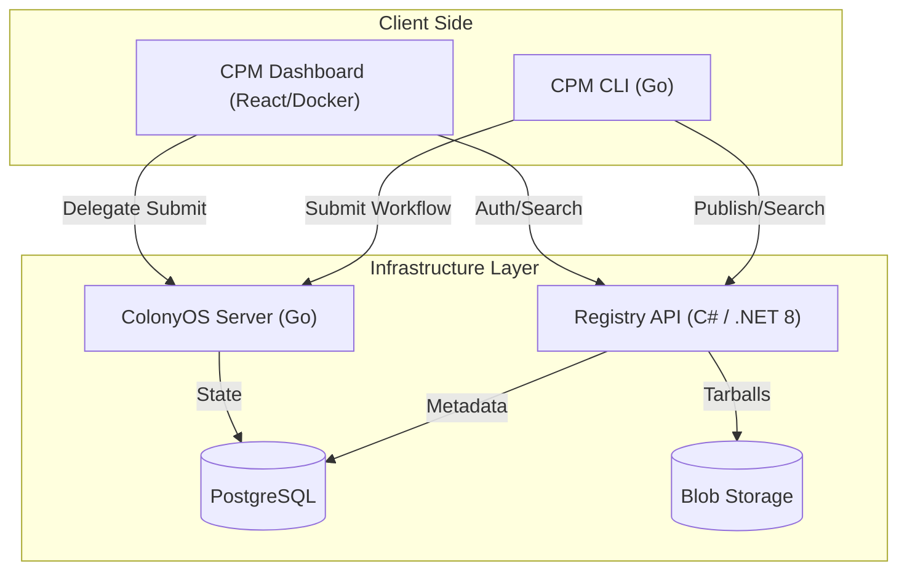

# CPM System Architecture

This document defines the high-level architecture of the Colony Package Manager (CPM) ecosystem. It serves as a map for developers to understand how the components in `frontend/`, `backend/`, and `infrastructure/` interact.

## Components & Documentation Map

| Component | Role | Requirement Document |
| :--- | :--- | :--- |
| **CPM CLI** | Client / Go Core | `backend/CPM_Backend_Requirements.md` |
| **Registry API** | Central Hub / C# | `backend/CPM_Registry_API_Requirements.md`   `infrastructure/CPM_SERVER_Registry_Requirements.md`|
| **CPM Dashboard** | Web UI / React | `frontend/CPM_Dashboard_App_Requirements.md`   `infrastructure/CPM_SERVER_Frontend_Requirements.md` |
| **ColonyOS Server** | Execution Engine | `infrastructure/CPM_SERVER_ColonyOS_Requirements.md`   `infrastructure/CPM_SERVER_ColonyOS_Automation.md` |

## System Topology & Data Flow

## Communications

### 1. CLI <-> Registry
*   **Protocol:** REST / HTTP 1.1
*   **Auth:** JWT (bearer token)
*   **Operations:** `POST /packages` (Upload), `GET /packages` (Search).
*   **Spec:** See `backend/CPM_Registry_API_Requirements.md`.

### 2. Dashboard <-> Registry
*   **Protocol:** REST / HTTP 1.1 (CORS enabled)
*   **Auth:** JWT
*   **Operations:** Read-only search, user auth.
*   **Spec:** See `frontend/CPM_Dashboard_App_Requirements.md`.

### 3. CLI <-> ColonyOS Core
*   **Protocol:** gRPC (default) or HTTP REST.
*   **Auth:** Ed25519 Signing (PrvKey derived).
*   **Operations:** `SubmitWorkflow`.

## Deployment Strategy

*   **Registry & Dashboard:** Deployed as Docker containers behind a reverse proxy (Nginx).
*   **ColonyOS Server:** Deployed as a binary or container, typically on the same "Control Plane" cluster.
*   **Database:** Shared PostgreSQL instance recommended for simplicity, with separate logical databases (`colonyos`, `cpm_registry`).

## Implementation Priorities

1.  **Backend Upgrade:** Modify `cpm` Go code to support `Inputs` schema (See `backend/CPM_Backend_Requirements.md`).
2.  **Registry API:** Build the C# API to enable remote storage.
3.  **Frontend:** Build the Dashboard once the API contract is stable.
