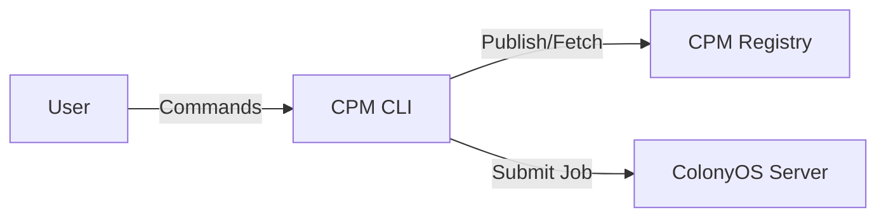
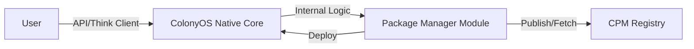
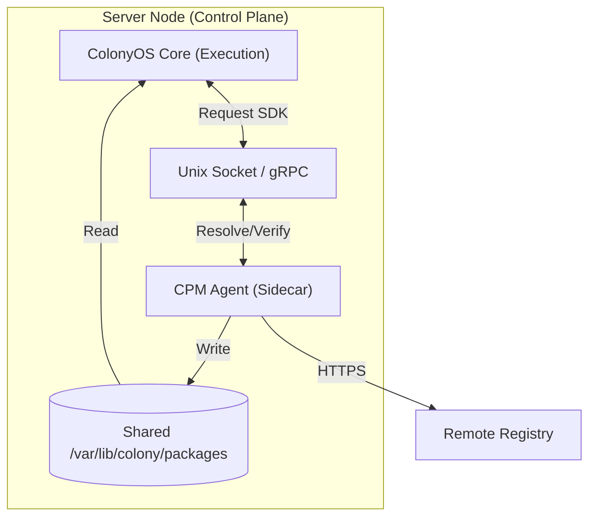

# Feasibility Analysis: ColonyOS Native Package Management

## 1. Executive Summary
This document explores the architectural shift from a standalone **CPM CLI** client to an integrated **ColonyOS Native** package manager. In this proposed model, the package management logic currently residing in the CPM CLI would be assimilated into the ColonyOS core execution engine.

**Verdict:** While technically possible, this approach introduces significant coupling risks and "Chicken and Egg" operational challenges that likely outweigh the benefits of integration for a general-purpose package manager.

## 2. Architectural Comparison

### Current Architecture (Standalone Client)
The CPM CLI acts as an independent agent, orchestrating interactions between the user, the Registry, and the ColonyOS Server.

### Proposed Architecture (Integrated)
The ColonyOS Server becomes the direct entry point for package management. The CLI becomes a thin client (or is removed in favor of direct API calls).

## 3. Impact Analysis

### 3.1. Core Feature: Package Management
The most critical unforeseen challenge sits here: **The Bootstrap Paradox.**
*   **Update Mechanism:** If ColonyOS is responsible for managing packages, it likely uses CPM to update generic software. If CPM is *part* of ColonyOS, how does ColonyOS update itself? You risk complex "hot-swapping" scenarios where the updater must update the logic that is currently running the update.
*   **Developer Experience:** A standalone CLI allows developers to package, lint, and validate applications on their local machine without running a full ColonyOS server instance. Integrating it forces a heavy dependency on the local dev environment (must run the full OS daemon just to tar a file).

### 3.2. Optimization
*   **Pros:** Shared memory and caching. If ColonyOS needs to run a package, it doesn't need to invoke an external binary; it can stream data directly from its internal package module to the execution runtime.
*   **Cons:** The ColonyOS binary size increases. The "Control Plane" generally needs to be lean and high-availability. Adding complex compression/network logic (package management) to the critical path of the OS kernel affects stability.

### 3.3. Modifiability & Extendability
*   **Impact: NEGATIVE**
*   **Coupling:** Changes to the package definition spec (e.g., adding `Inputs` as requested in v1.0) would require recompiling and redeploying the entire ColonyOS fleet. A standalone CLI can be updated independently.
*   **Plugins:** A CLI is easily wrapped by scripts or CI/CD pipelines. An integrated system often requires a formal plugin architecture (WASM/Go Plugins) which is significantly harder to maintain.

### 3.4. Maintenance & Ecosystem
*   **Versioning Hell:** You bind the release cycle of the Package Manager to the release cycle of the OS. If a critical bug is found in package resolution, you cannot just ship `cpm v1.0.1`; you must ship `ColonyOS v2.4.1`.
*   **Security:** Package managers often parse untrusted input (manifests, tarballs). Running this parsing logic inside the privileged memory space of the ColonyOS Kernel/Server is a security risk. A crash in the parser crashes the entire Node/Cluster.

## 4. Unforeseen Challenges Summary

| Category | Challenge | Severity |
| :--- | :--- | :--- |
| **Lifecycle** | **Self-Hosting (Bootstrap):** Updating the package manager requires restarting the OS. | Critical |
| **DevOps** | **CI/CD Friction:** Pipelines must talk to a running daemon rather than just running a binary. | High |
| **Stability** | **Blast Radius:** A bug in `cpm install` could crash the active `colonyos-server` process, causing downtime for running workloads. | Critical |
| **Security** | **Privilege Escalation:** Parsing malicious packages in the OS context opens attack vectors. | High |

## 5. Recommendation
**Do Not Integrate.** 

Keep the **CPM CLI** as a standalone "User Agent".
*   **Separation of Concerns:** The OS should focus on *Execution* and *Resource Management*. The Package Manager should focus on *Resolution* and *Distribution*.
*   **Unix Philosophy:** "Make each program do one thing well."
*   If tighter integration is desired, consider a **Sidecar Pattern**: A `cpm-agent` that runs alongside ColonyOS but as a separate process, managed by the CLI but local to the server (See Section 6).

## 6. Sidecar Pattern Integration

This alternative proposes running a dedicated `cpm-agent` process alongside the core `colonyos-server`. This matches the successful pattern seen in Kubernetes (kube-proxy, CNI plugins) and Service Meshes (Envoy sidecars).

### 6.1. Architecture
*   **Topology:** `colonyos-server` (The Kernel) and `cpm-agent` (The Package Manager) run as sibling processes. In a containerized environment, they share a Pod. In a bare-metal environment, they are separate systemd units.
*   **Communication:** High-speed local loopback using **gRPC over Unix Domain Sockets**.
*   **Shared Volume:** Both processes mount a shared `packages/` directory. The Agent writes (downloads/unpacks), the Core reads (mounts/executes).

### 6.2. Benefits
*   **Fault Isolation:** If the package manager crashes (e.g., OOM while decompressing a massive 10GB layer), the Critical Path (ColonyOS Core) remains stable and keeps running existing workloads.
*   **Security Segmentation:** The Agent can run with reduced privileges (e.g., `nobody` user with write access only to the package cache), while the Core retains `root`/`privileged` access required for container orchestration.
*   **Independent Lifecycle:** You can upgrade `cpm-agent` to support new registry protocols or compression formats without restarting the main OS kernel.
*   **Performance:** By using Unix Sockets and shared volumes, the performance penalty compared to "native code" is negligible (microseconds).

### 6.3. Risks & Challenges
*   **Operational Complexity:** "It works on my machine" becomes harder. Developers must run both processes to simulate a full environment. Operators must monitor two health signals instead of one.
*   **Version Skew:** In a large fleet, you might end up with `ColonyOS v2.0` trying to talk to an outdated `cpm-agent v1.0` that doesn't understand a new gRPC field. Strict API versioning contracts are required.
*   **Resource Overhead:** Running two Go runtimes means double the idle memory footprint and CPU context switching, although for modern servers this is usually a minor cost.

### 6.4. Verdict on Sidecar
This is the **Recommended Path** if and only if "Zero-dependency Client" is a hard requirement. It provides the user experience of an integrated system (User talks to ColonyOS, ColonyOS delegates to Sidecar) while maintaining the engineering rigour of a distributed system.
