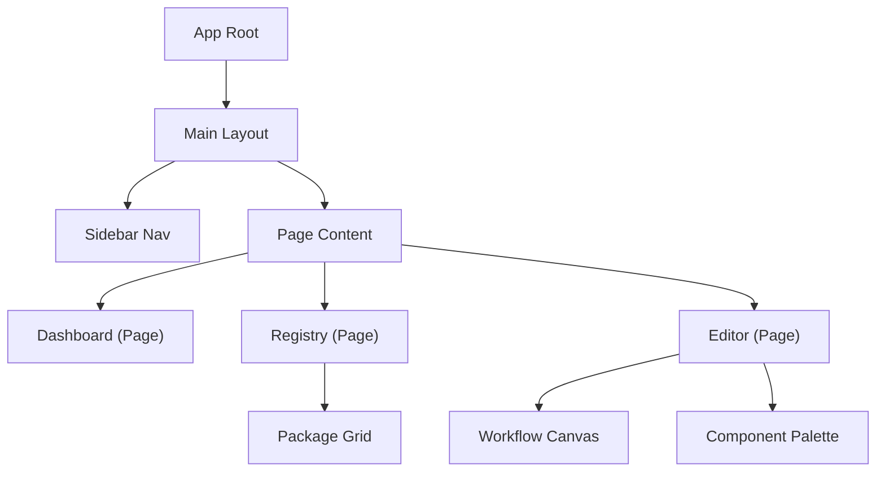

# CPM Dashboard App Requirements

### Architecture Context
**Component:** CPM Dashboard
**Role:** Web UI
This document specifies the requirements for the **React-based Frontend**. It communicates with the Registry API and provides a visual interface for the ecosystem.

**Version:** 1.0 (Draft)
**Target Audience:** Frontend Developers
**Goal:** Build a premium, React-based web interface for Colony Package Manager (CPM) that allows users to discover packages and visually build workflows.

---

## 1. Technology Stack

The application must use the following modern stack to ensure performance, type safety, and a premium user experience:

*   **Core:** React 18+ (Functional Components, Hooks)
*   **Language:** TypeScript 5+ (Strict Mode enabled)
*   **Build Tool:** Vite (Fast HMR)
*   **Styling:** Tailwind CSS (Utility-first) + `clsx`/`tailwind-merge`
*   **UI Components:** Shadcn/UI (Headless Radix Primitives + Tailwind) / Luicde React (Icons)
*   **State Management:**
    *   *Server State:* TanStack Query (React Query) v5
    *   *Global Form State:* Zustand (if complex cross-component state is needed)
*   **Routing:** React Router v6+ (Data Router APIs)
*   **Forms:** React Hook Form + Zod (Schema Validation)
*   **Visualization:** React Flow (for DAG/Workflow rendering)

#### Frontend Component Map


---

## 2. Project Structure

Adhere to a feature-based folder structure to maintain scalability.

```text
src/
├── assets/             # Static assets (fonts, images)
├── components/         # Shared UI components (Button, Input, Card)
│   └── ui/             # Shadcn components
├── features/           # Feature-based modules
│   ├── editor/         # Logic for the Template Builder
│   │   ├── components/
│   │   ├── hooks/
│   │   └── types.ts
│   ├── registry/       # Logic for the Package Browser
│   └── dashboard/      # Logic for the Home/Overview
├── hooks/              # Shared custom hooks
├── layouts/            # Page layouts (MainLayout, AuthLayout)
├── lib/                # Utilities (API client, cn helper)
├── pages/              # Route entry points (lazy loaded)
├── services/           # API service definitions
└── types/              # Global TypeScript definitions
```

---

## 3. Core Features & Requirements

### A. Global Layout & Navigation
*   **Sidebar Navigation:** Collapsible sidebar with links to Dashboard, Registry, Builder, and Settings.
*   **Premium Aesthetic:** Dark mode by default, subtle glassmorphism on panels, smooth transitions (Framer Motion recommended for route transitions).
*   **Responsive:** Must work on Desktop (primary) and Tablet.

### B. Dashboard (Home)
*   **Overview Cards:** Display "Quick Stats" (e.g., Connected Registry Status, Recent Templates).
*   **Recent Activity:** List of recently opened or edited `colony.yaml` files (stored in `localStorage` for MVP).

### C. Registry Browser
*   **Search Interface:** Omnibar searching by package name, tag, or author.
*   **Package Grid:** Display packages as "Cards" with:
    *   Icon/Avatar
    *   Name & Version badge
    *   Short description
    *   "Install" command copy button
*   **Package Detail View:**
    *   Render `README.md` (Markdown support required).
    *   List Input Variables (`spec.inputs`).
    *   "Use in Builder" button (Detailed in Section D).

### D. Visual Template Builder (Core Capability)
*   **Goal:** Allow users to create valid `colony.yaml` files without writing YAML manually.
*   **Two-Pane Layout:**
    *   *Left*: Canvas/Form view.
    *   *Right*: Real-time YAML preview (Read-only, highligted).
*   **Drag-and-Drop:** Ability to drag a "Package" from a palette onto a "Workflow Canvas" (React Flow).
*   **Node Configuration:** Clicking a node (package) opens a side panel to fill in `spec.inputs` using generated forms based on the variable type (text, number, boolean).
*   **Validation:** Prevent export if required inputs are missing.

### E. Documentation & Onboarding
*   **In-App Guide:** A "Getting Started" overlay or wizard for first-time users.
*   **Contextual Help:** Tooltips on all form fields explaining what "Replica Count" or "Colony ID" means.
*   **Embedded Wiki:** A read-only view of the CPM Wiki (served via Markdown) within the app for quick reference.

### F. Authentication
*   **Registry Auth:** Login screen using CPM Registry credentials (likely JWT based).
*   **ColonyOS Delegation:** For deploying workflows, the user must provide their ColonyOS Private Key (PrvKey).
    *   *Security Note:* This key should *never* be stored permanently in the browser. Use `sessionStorage` or request it per session/action.

---

## 4. Backend Gap Analysis & Data Models

### Gap Analysis
To support the "Visual Template Builder", the current `ColonyManifest` in the Go backend (`pkg/domain/manifest.go`) must be extended. Currently, it lacks a formal definition of input variables.

**Required Backend Change:**
Add an `Inputs` field to `colony.yaml` so the frontend knows what fields to generate forms for.

### Updated Data Models (TypeScript Interfaces)

**Package Definition:**
```typescript
interface CPMPackage {
  name: string;
  version: string;
  description: string;
  // New field required in Go backend
  inputs: CPMInputVariable[]; 
  maintainers: Maintainer[];
}

interface CPMInputVariable {
  key: string;       // e.g., "gpu_count"
  label: string;     // e.g., "GPU Allocation"
  type: 'string' | 'number' | 'boolean' | 'select';
  description?: string;
  required: boolean;
  default?: string | number | boolean;
  options?: string[]; // For 'select' type
}
```

---

## 5. Development Workflow

### Initialization
```bash
npm create vite@latest cpm-dashboard -- --template react-ts
cd cpm-dashboard
npm install
npm install -D tailwindcss postcss autoprefixer
npx tailwindcss init -p
```

### Mocking API
Since the Backend API might not be ready, developers should implement a Mock Service Worker (MSW) or a simple `api.mock.ts` layer to simulate:
*   `GET /packages`: Returns a list of dummy packages.
    *   `GET /packages/:name`: Returns package details.

---

## 6. Hosting & Deployment

The hosting details (Docker, Environment Variables, Nginx Config) have been moved to a dedicated specification for the DevOps team.

**See:** [CPM_SERVER_Frontend_Requirements.md](../infrastructure/CPM_SERVER_Frontend_Requirements.md)

## 7. Deliverables
1.  **Source Code:** Git repository with clear commit history.
2.  **Docker image:** A validated `Dockerfile` for serving the static build (Nginx).
3.  **Storybook:** (Optional) If time permits, basic stories for core UI components.
