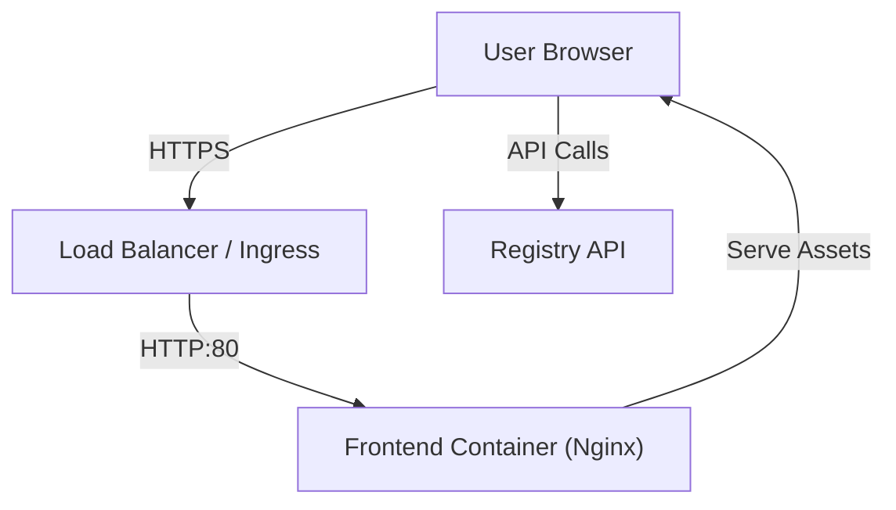

# CPM Frontend Hosting Requirements

### Architecture Context
**Component:** CPM Content Delivery
**Role:** Web Server / CDN
This document helps the Site Reliability Engineer (SRE) or DevOps team prepare the **hosting environment** for the React-based Web Dashboard.

Unlike the ColonyOS Core, this is a **stateless** workload that primarily serves static assets (`.js`, `.css`, `.html`).

## Infrastructure

### 1. Compute Requirements
*   **Type:** Container (Docker/Kubernetes) or Static File Hosting (S3+CloudFront, Netlify, Vercel).
*   **Operating System:** Alpine Linux (Container Base).
*   **CPU:** 0.5 vCPU (Minimal usage).
*   **RAM:** 128MB - 256MB (Nginx overhead only).

### 2. Network
*   **Public Access:** Must be accessible via HTTPS (port 443).
*   **Internal Access:** Must be able to reach:
    *   **Registry API:** For package search/reads (Public or Internal).
    *   **ColonyOS Server:** For workflow submission (via gRPC-Web or Proxy).

#### Component Map


## Deployment Specifications

### 1. Docker Container
The application is delivered as a production-ready Docker image.

*   **Image Name:** `cpm-dashboard`
*   **Internal Port:** `80`
*   **Volume Mounts:** None (Stateless).

### 2. Environment Variables (Runtime Injection)
Since the app is a Single Page Application (SPA), environment variables must be injected into the `window` object at runtime (usually via `env.sh` script in the container entrypoint), OR hardcoded at build time.

**Key Variables:**
*   `REACT_APP_REGISTRY_API_URL`: Public URL of the Registry API (e.g., `https://registry.cpm.colonyos.io`).
*   `REACT_APP_COLONYOS_URL`: Public URL of the ColonyOS Server (e.g., `https://core.colonyos.io`).

### 3. Nginx Configuration
The container uses Nginx. Key configuration requirements:

*   **SPA Fallback:** Must route `404` errors to `index.html` to support React Router HISTORY mode.
    ```nginx
    location / {
        try_files $uri $uri/ /index.html;
    }
    ```
*   **Caching:**
    *   `index.html`: No-Cache.
    *   `static/**`: Long-term cache (1 year).

## Security
*   **TLS:** HTTPS is **mandatory** for Crypto/Signing features in the browser (SubtleCrypto API).
*   **CORS:** The *Registry API* and *ColonyOS Server* must allow requests from this domain.
