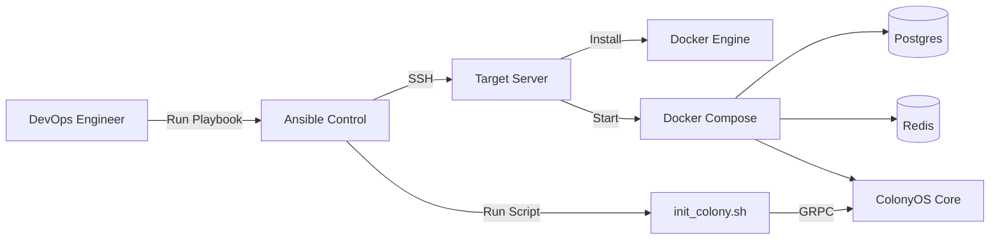

# Server Configuration & Automation Requirements

### Architecture Context
**Component:** ColonyOS Server (Automation)
**Role:** DevOps / Provisions
This document defines the **scripts and automation** (Ansible/Bash) needed to boostrap the infrastructure defined in `server_requirements.md` and configure the ColonyOS state.

**Scope:** DevOps & Provisioning logic for the ColonyOS Server
**Goal:** Automate the deployment and state configuration of the ColonyOS environment for CPM testing and production.

#### Automation Workflow

## 1. Provisioning Automation (The "How")
We need a repeatable way to set up the server from a fresh OS install.

*   **Tools:**
    *   **Bash Scripts (MVP):** Simple `setup.sh` for single-node deployments.
    *   **Ansible (Recommended):** Playbooks for idempotency and easier management of secrets/config files.
*   **Artifacts to Create:**
    *   `deploy/ansible/playbook.yml`: Main entry point.
    *   `deploy/scripts/install_dependencies.sh`: Installs Docker, Postgres client, jq, etc.

## 2. ColonyOS State Initialization
Once the binaries are running, the server needs to be bootstrapping with data. We need a specific script (`init_colony.sh`) to:

1.  **Generate Identities:**
    *   Create a Server PrvKey (if not existing).
    *   Create a Colony PrvKey.
2.  **Register Entities:**
    *   **Colony:** Register the main `cpm_colony`.
    *   **Executor:** Register a generic executor (required for submitting workflows).
3.  **Output Secrets:**
    *   Save generated IDs and Keys to a `.env` file or a JSON manifest so `cpm` and the Web Dashboard can use them.

## 3. Service Orchestration
Define how services run and restart.

*   **Docker Compose:**
    *   Create a `docker-compose.yml` defining:
        *   `postgres`: With persistent volume mapped to host.
        *   `redis`: With password protection.
        *   `colonyos-server`: Linked to DB/Redis.
*   **Systemd (Alternative):**
    *   If running binaries directly, create standard unit files (`/etc/systemd/system/colonyos.service`).

## 4. Networking & Proxy Configuration
The server needs a reverse proxy to handle TLS termination and routing.

*   **Nginx Configuration Generator:**
    *   Script to generate an `nginx.conf` that:
        *   Proxies `grpc` traffic (HTTP/2) to port `50051`.
        *   Proxies `http` traffic (REST) to port `8080`.
        *   (Optional) Proxies Web Dashboard to port `3000`.
*   **TLS Support:**
    *   Integration with `certbot` for auto-renewal.
    *   Fallback to generation of self-signed certs for dev environments.

## 5. Maintenance Scripts
*   **Backup:** `backup_db.sh` to dump the Postgres database to S3 or local disk.
*   **Update:** `update_server.sh` to pull the latest ColonyOS binary/image and restart services with minimal downtime.
