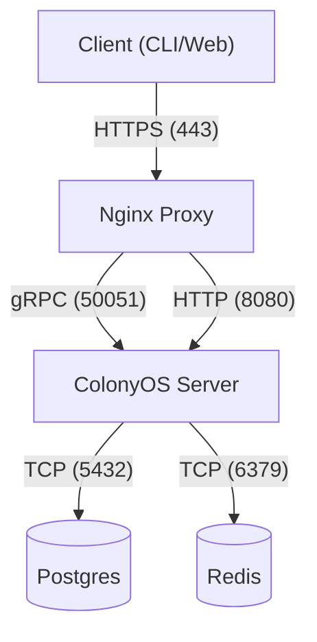

# ColonyOS Server Requirements

### Architecture Context
**Component:** ColonyOS Server (Hosting)
**Role:** Execution Engine
This document helps the Site Reliability Engineer (SRE) or DevOps team prepare the **bare metal or VM infrastructure** required to run the ColonyOS core.

To release and test the Colony Package Manager (CPM) effectively, a live ColonyOS environment is required for integration testing. This document outlines the infrastructure and configuration requirements.

## Infrastructure

### 1. Compute
*   **OS:** Linux (Ubuntu 20.04/22.04 LTS recommended)
*   **CPU:** Minimum 2 vCPUs
*   **RAM:** Minimum 4GB
*   **Storage:** 20GB+ SSD

### 2. Software Installation
*   **ColonyOS Server:** The core binary (`colonies_server`) must be installed and running.
*   **Docker Engine:** Required if the server will also act as an executor or if running ColonyOS components in containers.
*   **Git:** Required for fetching repositories (if not using pre-built binaries).

### 3. Dependencies
ColonyOS requires the following services to be running:

*   **Database:** PostgreSQL 13.0 or higher
    *   *Purpose:* Persistent storage for workflows, colonies, and users.
*   **Message Broker:** Redis 6.0 or higher
    *   *Purpose:* Fast queue management for job processing.

### 4. Network
The server must be accessible from the machine running CPM.

#### Network Topology

*   **Ports:**
    *   `50051` (TCP): Default gRPC port for ColonyOS API.
    *   `8080` (TCP): Default HTTP port for REST API (if enabled).
    *   `22` (TCP): SSH access for administration.

### 5. Runtimes & SDKs (Recommended)
To support a wide range of packages and workflows, the following should be installed:

*   **Go (1.20+):** Required if building ColonyOS components or if running Go-based workers.
*   **Python (3.8+):** Essential for data science, AI/ML workflows, and generic scripting.
*   **Node.js (16+):** Recommended for web-based workflows or JS executors.
*   **ColonyOS SDKs:**
    *   *Go SDK:* `github.com/colonyos/colonies/go`
    *   *Python SDK:* `pip install colonyos` (if available/desired for Python executors)

## Security

### 1. Cryptography
*   **Root Identity:** An Ed25519 keypair is required to initialize the server.
    *   *Tools:* Use `colonyos install` or `openssl` (if manually managing).

### 2. TLS/SSL
*   **Certificates:** Valid TLS certificates are strongly recommended for all gRPC/HTTP traffic.
    *   *Development:* Self-signed certificates (requires adding CA to CPM's trust store).
    *   *Production:* Let's Encrypt or other trusted CA.

## Verification
Once deployed, verify the server is ready for CPM:

1.  **Health Check:** Ensure the ColonyOS binary is running.
2.  **Connectivity:** Verify `telnet <host> 50051` connects.
3.  **Authentication:** Ensure you can authenticate with the `prvkey` used during setup.
